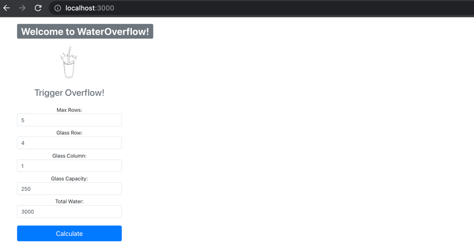
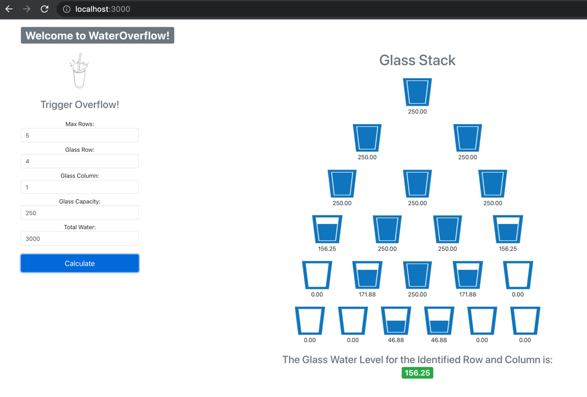
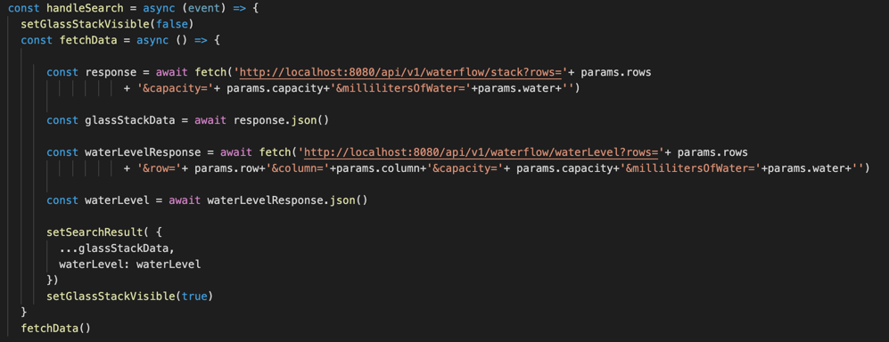

# wateroverflow-react-app
This is the front-end application for the wateroverflow api

# The Simple Front-End Layout
The front-end application used to manually test the Wateroverflow API
was designed simply for the purpose of being able to run end-to-end testing of the API

When the page initially loads, we only see the form visible

After specifying some values for the wateroverflow simulation and submitting the button, the Glass Stack is display to the right of the
form and the Water Level for the specified row and column is displayed at the bottom:

# The Source Package Structure
3 Simple components, namely: Form, Glass Stack, and the Glass card components were created

Here is the part which calls the Wateroverflow API

# The Techstack
1. React Js
2. Bootstrap for simple styling
3. Node Package Manager (NPM)

# How To Run
1. Ensure you have NPM installed
2. In the root directory of the project, execute the comman npm install. This will install the dependency packages
3. Once done, just execute the command npm start and it should automatically load the locahost page via port 3000 (default)

# Assumptions
1. There will be layout issues that may be encountered when testing the application
2. Not much time was devoted for this as during 1 day development, there was minimal time to consider multiple scenarios
3. The purpose of the application is to be able to call the two end points for the Waterflow RESTful API which can be downloaed
   and should be run prior to running this front-end application.
   The GitHub repository for the API is here -> https://github.com/randomthinkr/wateroverflow
4. Did not include validation of input values. I will add after submission for future public use.
   
